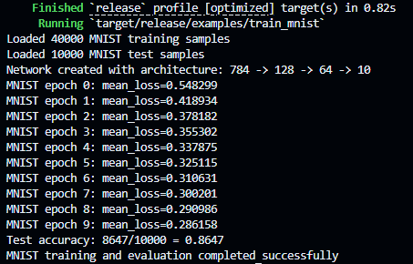

# rs-neuralnet

Inspired by 3Blue1Brown's [articles](https://www.3blue1brown.com/topics/neural-networks), motivated to learn some [Rust](https://rust-lang.org/), and fascinated by the maths behind neural nets, I decided it would be fun to implement my own little neural net in Rust!

## Layers

Consistent with 3b1b, I decided to go with a neural net with fully connected layers.

## The forward pass

Each layer in the neural net takes in some input, applies a set of transformations to yield an output, which is consequently passed onto the next layer.

At a high level, each node in a layer is influenced by every node in the previous layer, thought not necessarily equally. This 'influence' can be modelled as a weighted sum of the previous layer's node outputs. Finally, a bias is added onto the resultant sum.

For the $l^{th}$ layer, let's define:
- $a^{l-1}$ to be the input
- $W^l$ to be the weights matrix
- $B^l$ to be the bias row vector
- $\sigma^l$ to be the activation function
- $z^l$ to be the pre-activation output row vector
- $a^l$ to be the post-activation output row vector

So, what the heck is the stuff that isn't just the input and output?

Well, the *other stuff* is what we use to generate $z$ and $a$.

Let $j$ index the $j^{th}$ node in layer $l-1$. 
Let $k$ index the $k^{th}$ node in layer $l$.  
Let $w^l_{jk}$ denote the $j^{th}$ node's weighted influence towards node $k$.  
Let $b^l_{k}$ denote the $k^{th}$ node's bias.  

Traditionally, it should be $w^l_{kj}$ to denote the $j^{th}$ node's weighted influence towards node $k$, but in implementation, we usually use the transposed matrix.

Now, we can find $z^l_k$, the $k^{th}$ node's pre-activation value.
$$
\begin{align*}
z^l_k &= \sum_{j} w^l_{jk} a^{l-1}_j + b^l_k
\end{align*}
$$

And $a^l_k$.
$$
\begin{align*}
a^l_k &= \sigma^l(z^l_k)
\end{align*}
$$

Through some observation, we find an elegant expression for $z^l$.
$$
\begin{align*}
z^l &= a^{l-1} W^l + B^l
\end{align*}
$$

Which naturally gives $a^l$.
$$
\begin{align*}
a^l &= \sigma^l(z^l)
\end{align*}
$$

## The backward pass

After we obtain $a^L$, the output of the final layer, we need a measure of how 'good' the output is, which is effectively equivalent to measuring how 'bad' the output is.

Thus, we can come up with a cost function, which will tell us how bad our predictions are.

Let's call this cost function $C$.

Here, we will use Cross Entropy Loss as $C$, and our goal will be to minimise the output of $C$.

### Gradient Descent

The maths behind this scary sounding name is surprisingly clean.

We need to find $\nabla C$, which will give us the negative gradient, which is used to 'descend' down $C$.

We can split up $\nabla C$ into two parts.

$$
\begin{align*}
\nabla C &= \left< \frac{\partial C}{\partial W}, \frac{\partial C}{\partial B} \right>
\end{align*}
$$

Now, let's consider one specific layer $l$.

Recall

$$
\begin{align*}
z^l &= a^{l-1} W^l + B^l \\
a^l &= \sigma^l(z^l) \\
\end{align*}
$$

By the chain rule, we can observe that

$$
\begin{align*}
\frac{\partial C}{\partial w^l_{jk}}

&= \frac{\partial z^l_k}{\partial w^l_{jk}} \frac{\partial a^l_k}{\partial z^l_k} \frac{\partial C}{\partial a^l_k} \\

&= a^{l-1}_j \cdot \sigma^{(l)\prime}(z^l_k) \cdot \frac{\partial C}{\partial a^l_k} \\
\end{align*}
$$

Now, this part is where I like to think the term *back propagation* originates.

Let's first try find an expression for $\frac{\partial C}{\partial a^{l-1}_j}$.

$$
\begin{align*}
\frac{\partial C}{\partial a^{l-1}_j}

&= \frac{\partial z^l_k}{\partial a^{l-1}_j} \frac{\partial C}{\partial z^l_k} \\
\end{align*}
$$

WLOG, we can shift the layer to the right by one, and observe that the $(l+1)^{th}$ layer can compute $\frac{\partial C}{\partial a^l_k}$!!

Obviously, the last layer $L$ does not have a layer to its right, but that's not a problem.

$$
\begin{align*}
\frac{\partial C}{\partial a^L_k} &= \sigma^{(L)\prime}(a^L_k) \\
\end{align*}
$$

Next up, we have the bias.

$$
\begin{align*}
\frac{\partial C}{\partial b^l_k}

&= \frac{\partial z^l_k}{\partial b^l_{k}} \frac{\partial a^l_k}{\partial z^l_k} \frac{\partial C}{\partial a^l_k} \\

&= 1 \cdot \sigma^{(l)\prime}(z^l_k) \cdot \frac{\partial C}{\partial a^l_k} \\

&= \sigma^{(l)\prime}(z^l_k) \cdot \frac{\partial C}{\partial a^l_k} \\
\end{align*}
$$

Since we want to minimise $C$ over the entire training set, we can find the gradients of each individual sample, and then let $\nabla C$ be the average.

Now, instead of receiving a row vector as the input, we receive a matrix with multiple rows, and the number of columns remains constant.

Let $N$ denote the number of nodes in the $(l-1)^{th}$ layer.  
Let $M$ denote the number of nodes in the $l^{th}$ layer.  
Let $A$ be the input matrix, with dimensions $S \times N$.  

Also, let
$$
\begin{align*}
\delta^l_{ik} &= \sigma^{(l)\prime}(z^l_{ik}) \cdot \frac{\partial C}{\partial a^l_{ik}} \\

\implies

\Delta^l &= \sigma^{(l)\prime}(z^l_{ik}) \odot \frac{\partial C}{\partial a^l_{ik}} \\
\end{align*}
$$

Note that row vectors are no longer row vectors. Taking this change into account is trivial - if a row vector's $x^{th}$ entry previously is $r_x$, now it becomes $r_{ix}$, as seen above.

Now, let's revisit $\nabla C$ w.r.t $w$.

$$
\begin{align*}
\frac{\partial C}{\partial w^l_{jk}}

&= \frac{1}{S} \sum_{i=1}^S a^{l-1}_{ij} \cdot \sigma^{(l)\prime}(z^l_{ik}) \cdot \frac{\partial C}{\partial a^l_{ik}} \\

&= \frac{1}{S} \sum_{i=1}^S a^{l-1}_{ij} \cdot \delta^l_{ik} \\

&= \frac{1}{S} \sum_{i=1}^S (A^{l-1})^T_{ji} \cdot \delta^l_{ik} \\

&= \left( \frac{1}{S} (A^{l-1})^T \Delta^l \right)_{jk} \\

\implies

\frac{\partial C}{\partial W^l} &= \frac{1}{S} (A^{l-1})^T \Delta^l \\
\end{align*}
$$

And also $\nabla C$ w.r.t $b$.

$$
\begin{align*}
\frac{\partial C}{\partial b^l_k}

&= \frac{1}{S} \sum_{i=1}^S \sigma^{(l)\prime}(z^l_{ik}) \cdot \frac{\partial C}{\partial a^l_{ik}} \\

&= \frac{1}{S} \sum_{i=1}^S \delta^l_{ik} \\
\end{align*}
$$

Here, let's define $\text{colSum}(X)$ to create a row vector $Y$, where

$$
\begin{align*}

Y_j &= \sum_{i} X_{ij}

\end{align*}
$$

So, we get

$$
\begin{align*}
\frac{\partial C}{\partial B^l} &= \frac{1}{S} \text{colSum}(\Delta^l) \\
\end{align*}
$$

...and tada! We have everything we need for $\nabla C$.

All that remains is updating $W^l$ and $B^l$.

$$
\begin{align*}

W^l &:= W^l - \frac{\partial C}{\partial W^l} \\

B^l &:= B^l - \frac{\partial C}{\partial B^l} \\

\end{align*}
$$

...and that is one epoch done!

### Stochastic Gradient Descent

Often, using the *entire* training set for one epoch is quite expensive.

Instead, we can break up the training set into small batches, which will result in much more epochs in the same amount of time, whilst still achieving the effect of gradient descent!

### Cost Function

Above, we looked at $C$, *but what do we actually use for the cost function?*

For multi-class classification, we typically go with cross entropy loss as our cost function.

To figure out the *what* and *why* behind this choice, we must understand the ouptut of our neural net.

Our neural net outputs a vector of logits, which can be normalised such that they sum to $1$, so that we may perceive these values as probabilities.

Let $q$ denote the normalised vector.

One way to find $q$ is to find the sum of $q$, and divide each value by this sum.

$$
\begin{align*}

q_i &:= \frac{z_i}{\sum_k {z}_k} \\

\end{align*}
$$

However, because of very nice properties of $e$, we instead do

$$
\begin{align*}

q_i &:= \frac{\exp(z_i)}{\sum_k \exp{z}_k} \\

\end{align*}
$$

to find the *softmax* of $z$.

Now, we have to consider our *goal*: predict the true class $y$.

Naturally, we want to maximise $q_y$, which is equivalent of maximising its negative log: $-\ln(q_y)$.

Hence, we get

$$
\begin{align*}

C(z) &= -\ln(q_y) \\

&= -\ln \left( \frac{\exp(z_y)}{\sum_k \exp(z_k)} \right) \\

&= -z_y + \ln \sum_k \exp(z_k) \\

\end{align*}
$$

We then find the gradient.

First consider case $1$: $i = y$.

$$
\begin{align*}

\frac{\partial C}{\partial z_i}

&= \frac{\partial C}{\partial z_y} \\

&= -1 + \frac{1}{\sum_k \exp(z_k)} \exp(z_y) \\

&= -1 + q_y \\

\end{align*}
$$

Then consider case $2$: $i \neq y$.

$$
\begin{align*}

\frac{\partial C}{\partial z_i}

&= 0 + \frac{1}{\sum_k \exp(z_k)} \exp(z_i) \\

&= q_y \\

\end{align*}
$$

So, we get a very clean expression for the gradient.

$$
\frac{\partial C}{\partial z_j} =

\begin{cases}

q_i - 1, & i = y \\
q_i,     & i \neq y \\

\end{cases}
$$

However, since our neural nets run on computers, our numbers are expressed as [floats](https://en.wikipedia.org/wiki/Floating-point_arithmetic), with limited precision.

This limitation may become a significant problem when dealing with *extremely* large numbers...

$$
\begin{align*}
\sum_k \exp(z_k)
\end{align*}
$$

Here, there is a very real possibility that this sum may cause a great loss of precision.

To combat this problem, we apply the max-shift method.

Let $m$ denote $\max(z)$.

We can find an alternate expression for softmax.

$$
\begin{align*}

q_i &= \frac{\exp(z_i)}{\sum_k \exp{z}_k} \\

&= \frac{\exp(z_i - m)}{\sum_k \exp(z_k - m)} \\

\end{align*}
$$

And thus the cost function.
$$
\begin{align*}

C(z) &= -z_y + \ln \sum_k \exp(z_k) \\

&= -z_y + \ln \sum_k \exp(z_k - m) \exp(m) \\

&= -z_y + \ln \left( \exp(m) \sum_k \exp(z_k - m) \right) \\

&= -z_y + m + \ln \sum_k \exp(z_k - m) \\

\end{align*}
$$

## Testing the model

After getting Claude to test the neural net on [MNIST fashion](https://github.com/zalandoresearch/fashion-mnist), we get this result.

